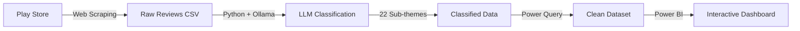

# ⭐ Swiggy vs Zomato  What Are Customers Really Saying?

<div align="center">


### 🚀 6,202 Play Store Reviews • Python + LLM + Power BI End-to-End Data Project

[](https://www.python.org/)
[](https://ollama.ai/)
[](https://powerbi.microsoft.com/)
[](https://github.com/yourusername)


> **"Everyone argues about which food-delivery app is better… so I decided to let DATA speak."**


</div>

---

## 📑 Table of Contents

- [About The Project](#-about-the-project)
- [Key Statistics](#-key-statistics)
- [Methodology](#-methodology-end-to-end-data-pipeline)
- [Key Insights](#-key-insights-based-on-the-dashboard)
- [Tech Stack](#-tech-stack--tools-used)
- [Getting Started](#-getting-started)
- [Repository Structure](#-repository-structure)
- [Results & Findings](#-final-verdict)
- [Roadmap](#-roadmap)
- [Contributing](#-contributing)
- [License](#-license)
- [Contact](#-contact)
- [Acknowledgments](#-acknowledgments)

---

## 🎯 About The Project

This project analyzes **6,202 Play Store reviews** of **Swiggy** and **Zomato** using an end-to-end data science pipeline that combines web scraping, LLM-based classification, and interactive visualization.

**What makes this project unique:**
- ✅ Real-world dataset from Play Store
- ✅ Custom LLM classification with 22 sub-themes
- ✅ Production-ready Python pipeline
- ✅ Interactive Power BI dashboard
- ✅ Actionable business insights

---

## 📊 Key Statistics

<div align="center">

| Metric | Swiggy | Zomato |
|:------:|:------:|:------:|
| **Total Reviews Analyzed** | 3,157 | 3,045 |
| **Average Rating** | ⭐ 3.54 | ⭐ 4.17 |
| **Positive Feedback** | 1,073 | 1,282 |
| **Food Quality Issues** | 481 | 297 |
| **App Technical Issues** | 119 | 78 |
| **Support Complaints** | 148 | 84 |
| **Data Collection Period** | October 2025 | October 2025 |

</div>

🎯 **Key Finding:** Zomato scored **18% higher** in average rating and showed superior performance across delivery, food quality, and customer support metrics.

---

## 🧠 Methodology (End-to-End Data Pipeline)



### **1️⃣ Data Collection**

- **Source:** Official Play Store pages
- **Tool:** Python web scraping
- **Output:** `input.csv` with 6,202 reviews
- **Fields:** Review text, rating, date, app name

### **2️⃣ AI-Powered Classification**

Implemented a custom LLM pipeline using **Ollama (Llama 3.2)** to classify reviews into **6 macro themes** and **22 sub-themes**:

<details>
<summary><b>📋 Click to view complete theme framework</b></summary>

#### **1. Delivery Experience (4 sub-themes)**
- Good Delivery Experience
- Rider Misbehavior
- Delivery Delay
- High Delivery Prices

#### **2. Food / Order Quality (4 sub-themes)**
- Good Food Quality
- Poor Food Quality
- Wrong / Missing Items
- Poor Packaging

#### **3. App & System Issues (5 sub-themes)**
- App Technical Issue
- Order / Tracking Issue
- Payment Issue
- Coupon / Promo Issue
- Good App Experience

#### **4. Support / Resolution (3 sub-themes)**
- Poor Customer Support
- Good Customer Support
- Refund / Compensation Issue

#### **5. Price / Charges (4 sub-themes)**
- High Prices
- Billing Errors
- Hidden / Extra Charges
- Good Value

#### **6. Positive Feedback (2 sub-themes)**
- Positive Experience
- Specific Praise

</details>

### **3️⃣ Data Cleaning (Power Query)**

- ✅ Standardized theme outputs
- ✅ Normalized sentiment labels
- ✅ Filtered out spam/noisy reviews
- ✅ Created calculated columns for analysis

### **4️⃣ Visualization (Power BI)**

Built an interactive dashboard featuring:
- 📊 Theme distribution comparison
- 📈 Rating trends over time
- 🔍 Sentiment analysis breakdown
- 🎯 Key metric cards
- 🔀 Dynamic filtering by app

---

## 📊 Key Insights (Based on the Dashboard)

### 🚚 **1. Delivery Experience**

```
Swiggy:  ████████████████████░░  1,073 mentions
Zomato:  ███████████████████████  1,282 mentions (+19%)
```

**Winner:** 🥇 Zomato — Customers reported more positive delivery experiences

---

### 🍕 **2. Food Quality Issues**

```
Swiggy:  ██████████░░░░░░░░░░  481 complaints
Zomato:  ██████░░░░░░░░░░░░░░  297 complaints (-38%)
```

**Winner:** 🥇 Zomato — Significantly fewer food quality complaints

---

### ⚙️ **3. App Technical Issues**

```
Swiggy:  ████████░░░░░░░░░░░░  119 issues
Zomato:  █████░░░░░░░░░░░░░░░  78 issues (-34%)
```

**Winner:** 🥇 Zomato — More stable app experience

---

### 💬 **4. Customer Support**

```
Swiggy:  ██████████░░░░░░░░░░  148 complaints
Zomato:  █████░░░░░░░░░░░░░░░  84 complaints (-43%)
```

**Winner:** 🥇 Zomato — Better support resolution

---

### 💰 **5. Pricing Complaints**

```
Swiggy:  ████░░░░░░░░░░░░░░░░  29 complaints
Zomato:  ███░░░░░░░░░░░░░░░░░  19 complaints (-34%)
```

**Winner:** 🥇 Zomato — Marginally better pricing satisfaction

---

## 🏆 Final Verdict

<div align="center">

### **🥇 Zomato is the clear winner across all key metrics**

| Category | Winner | Margin |
|----------|--------|--------|
| Overall Rating | 🔴 Zomato | +18% |
| Delivery Experience | 🔴 Zomato | +19% |
| Food Quality | 🔴 Zomato | +38% fewer issues |
| App Stability | 🔴 Zomato | +34% fewer issues |
| Customer Support | 🔴 Zomato | +43% fewer complaints |

</div>

**However:** Swiggy had **112 more reviews** in the dataset, indicating either higher user engagement or more vocal user base.

---

## 🛠 Tech Stack & Tools Used

<div align="center">

### **Languages & Libraries**


### **AI & Machine Learning**


### **Data Visualization**


### **Development Tools**


</div>

---

## 🚀 Getting Started

### **Prerequisites**

- Python 3.8 or higher
- Ollama installed on your system
- Power BI Desktop (for viewing dashboard)

### **Installation**

1. **Clone the repository**
   ```bash
   git clone https://github.com/yourusername/swiggy-zomato-analysis.git
   cd swiggy-zomato-analysis
   ```

2. **Install Python dependencies**
   ```bash
   pip install -r requirements.txt
   ```

3. **Pull the Llama 3.2 model**
   ```bash
   ollama pull llama3.2
   ```

4. **Run the classification pipeline**
   ```bash
   python review_classifier.py
   ```

5. **Open Power BI Dashboard**
   - Open `dashboard.pbix` in Power BI Desktop
   - Load `output_with_themes.csv` if needed
   - Explore the interactive visualizations

---

## 📂 Repository Structure

```
📦 swiggy-zomato-analysis
│
├── 📁 data/
│   ├── input.csv                    # Raw scraped reviews (6,202 rows)
│   ├── output_with_themes.csv       # Classified dataset with themes
│   └── data_dictionary.md           # Column descriptions
│
├── 📁 scripts/
│   ├── review_classifier.py         # Main LLM classification pipeline
│   ├── scraper.py                   # Play Store scraping script
│   └── utils.py                     # Helper functions
│
├── 📁 dashboard/
│   ├── dashboard.pbix               # Power BI dashboard file
│   ├── dashboard.png                # Dashboard preview
│   └── theme_definitions.json       # Theme framework reference
│
├── 📁 notebooks/
│   └── exploratory_analysis.ipynb   # Jupyter notebook with EDA
│
├── 📁 docs/
│   ├── methodology.md               # Detailed methodology
│   └── insights.md                  # Key findings document
│
├── .gitignore
├── LICENSE
├── README.md
├── requirements.txt
└── setup.py
```

---

## 🗺 Roadmap

- [x] Scrape Play Store reviews
- [x] Build LLM classification pipeline
- [x] Create Power BI dashboard
- [ ] Add sentiment analysis over time
- [ ] Implement real-time data updates
- [ ] Create web app for interactive exploration
- [ ] Add competitor analysis (Uber Eats, Deliveroo)
- [ ] Build predictive models for customer churn

See the [open issues](link-to-issues) for a full list of proposed features.

---

## 🤝 Contributing

Contributions make the open-source community amazing! Any contributions you make are **greatly appreciated**.

1. Fork the Project
2. Create your Feature Branch (`git checkout -b feature/AmazingFeature`)
3. Commit your Changes (`git commit -m 'Add some AmazingFeature'`)
4. Push to the Branch (`git push origin feature/AmazingFeature`)
5. Open a Pull Request

---

## 📜 License

Distributed under the MIT License. See `LICENSE` for more information.

---

## 📧 Contact

buddaratn9632@gmail.com

---

## 🙏 Acknowledgments

- [Ollama](https://ollama.ai/) for local LLM capabilities
- [Meta's Llama 3.2](https://ai.meta.com/llama/) for the language model
- [Power BI Community](https://community.powerbi.com/) for dashboard inspiration
- All the customers who shared their honest reviews

---

<div align="center">

### 💬 Your Thoughts?

**Team Swiggy 🟠 or Team Zomato 🔴?**

If you found this project helpful, please consider giving it a ⭐!

[](https://star-history.com/#yourusername/swiggy-zomato-analysis&Date)

Made with ❤️ and lots of ☕

</div>
